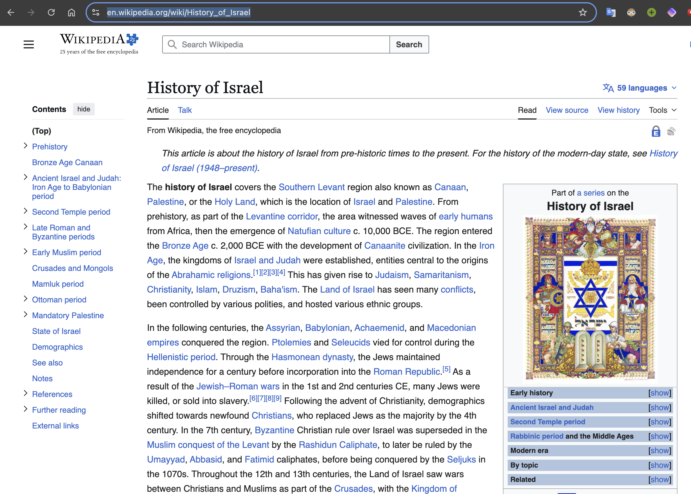
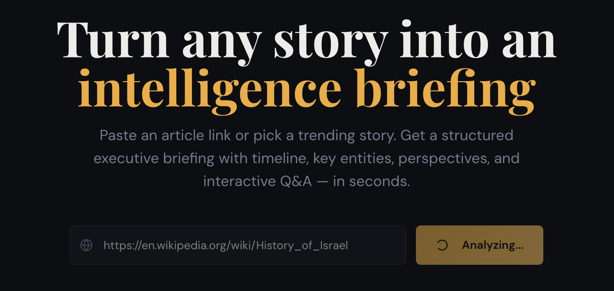
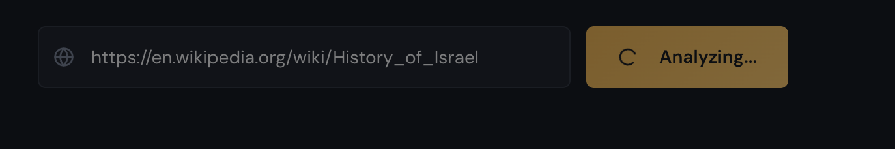
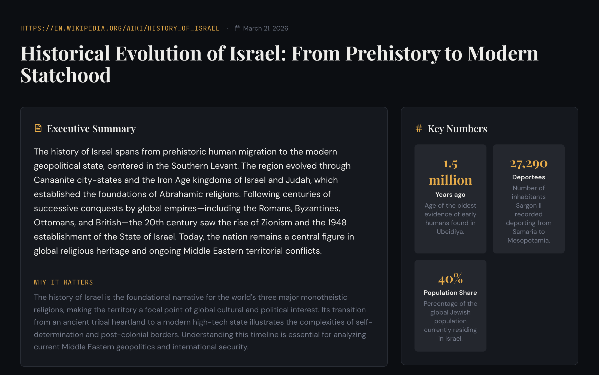
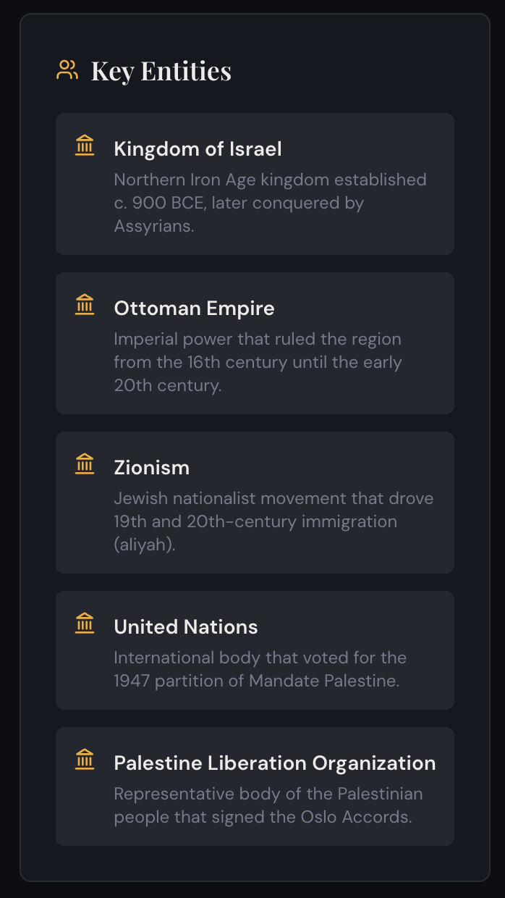
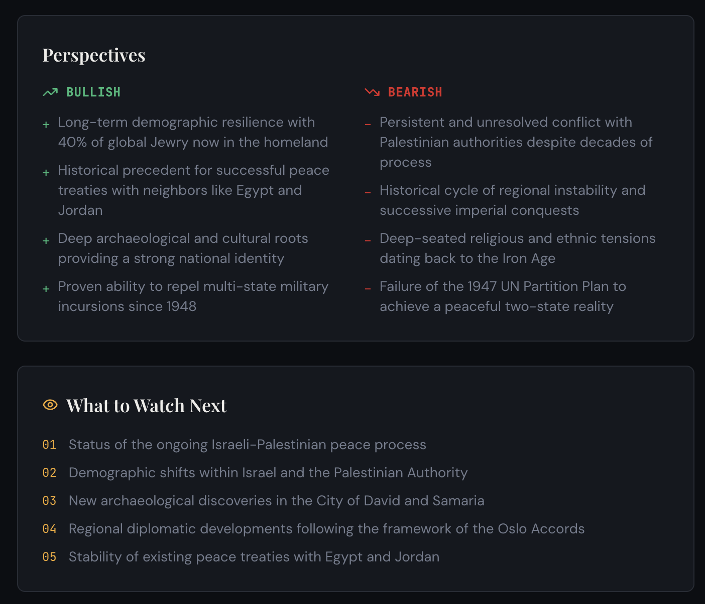
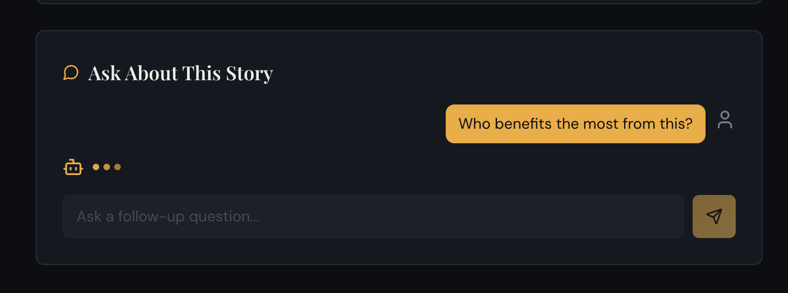
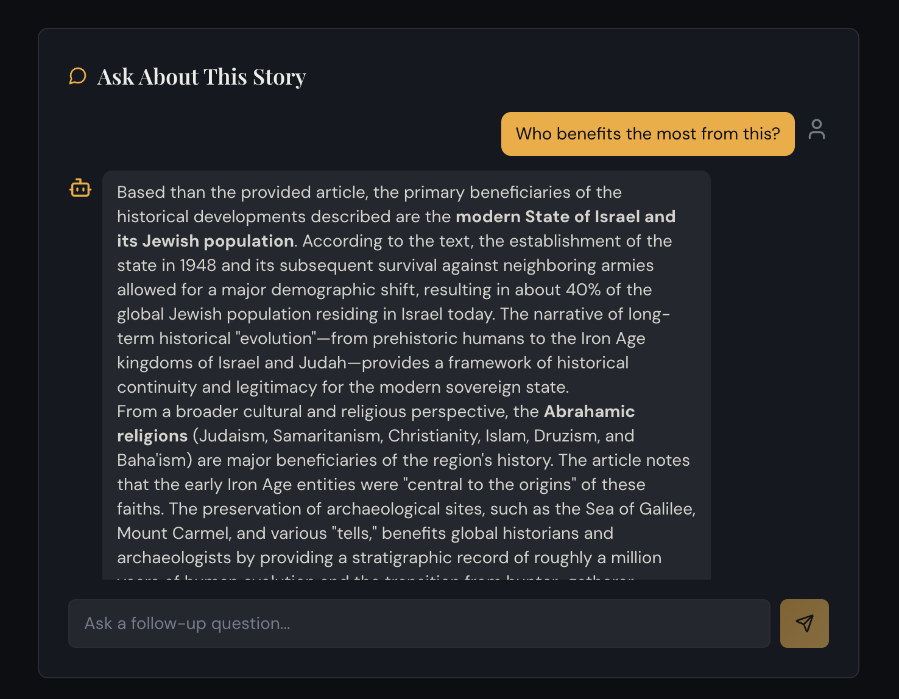
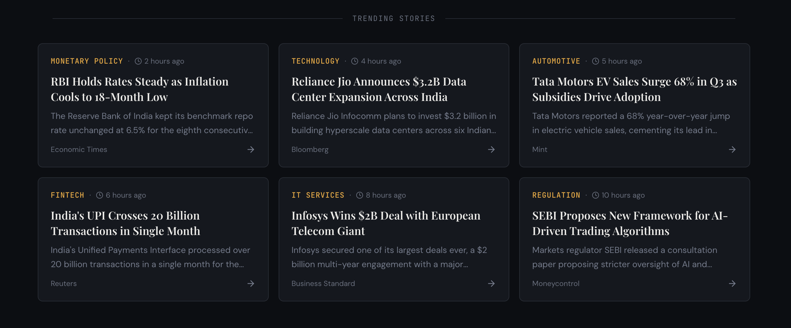
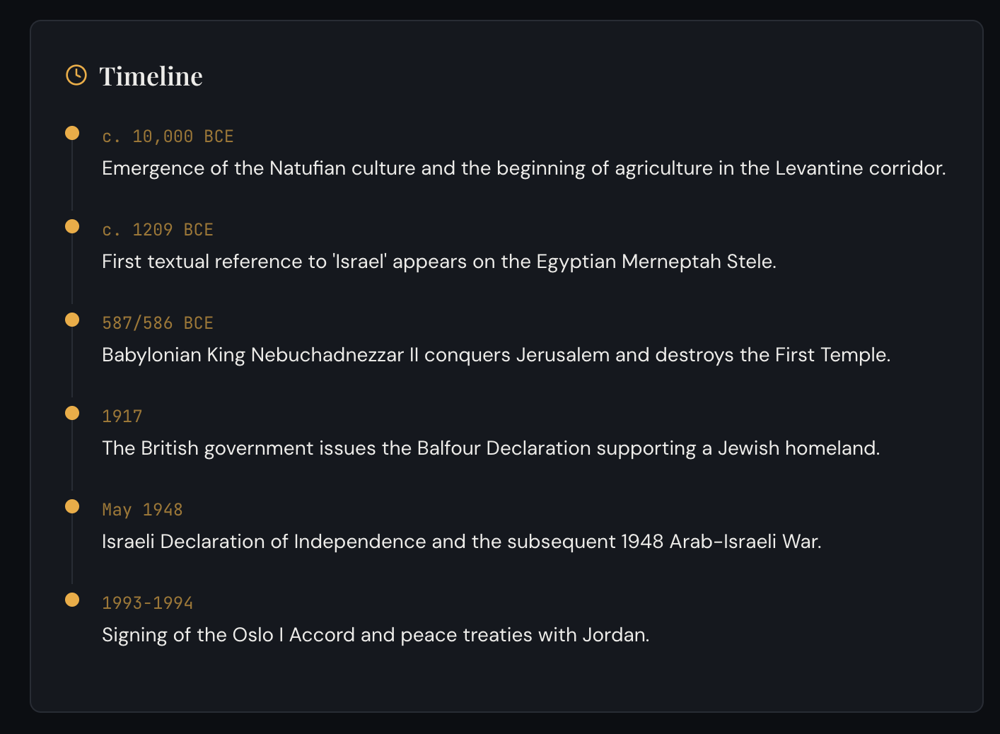

# NewsNavigator: Interactive Intelligence Briefing

Turn any news article into an AI-generated intelligence briefing with an executive summary, timeline, key entities, key numbers, perspectives, and contextual Q&A.

Live demo: https://news-intel-story-spark.lovable.app

## Table of Contents

- [Overview](#overview)
- [Core Features](#core-features)
- [How It Works](#how-it-works)
- [Tech Stack](#tech-stack)
- [Project Structure](#project-structure)
- [Local Development](#local-development)
- [Screenshot Gallery](#screenshot-gallery)
- [Roadmap](#roadmap)
- [License](#license)

## Overview

NewsNavigator helps users convert long-form news content into structured, decision-friendly insights in seconds. It is designed for fast understanding of complex stories by combining scraping, AI synthesis, and an interactive briefing UI.

## Core Features

- URL-based article ingestion
- AI-generated briefing with:
    - Executive summary and "Why it matters"
    - Chronological timeline
    - Key entities and context
    - Key numbers and significance
    - Bullish vs bearish perspectives
    - What to watch next
- Follow-up Q&A chat grounded in the analyzed article
- Trending stories feed from mock data

## How It Works

1. User submits an article URL from the homepage.
2. `scrape-article` edge function extracts article content via Firecrawl.
3. `generate-briefing` edge function generates a structured intelligence briefing via Gemini.
4. Frontend renders the full briefing view with modular sections.
5. `chat-qa` edge function powers follow-up questions using streaming responses.

## Tech Stack

| Layer | Technology |
| --- | --- |
| Frontend | React, TypeScript, Vite, Tailwind CSS, shadcn/ui, Framer Motion |
| State/Data | TanStack Query |
| Backend | Supabase Edge Functions |
| AI | Google Gemini 2.5 Flash (via Lovable AI Gateway) |
| Scraping | Firecrawl API |
| Testing | Vitest, Playwright |

## Project Structure

```text
src/
    pages/
        Index.tsx
        BriefingPage.tsx
    components/
        briefing/
            ExecutiveSummary.tsx
            Timeline.tsx
            KeyEntities.tsx
            KeyNumbers.tsx
            Perspectives.tsx
            WatchNext.tsx
            ChatPanel.tsx
    lib/
        api.ts
        mockData.ts
supabase/
    functions/
        scrape-article/
        generate-briefing/
        chat-qa/
```

## Local Development

### Prerequisites

- Node.js 18+
- npm

### Run the app

```bash
npm install
npm run dev
```

### Optional checks

```bash
npm run lint
npm run test
```

## Screenshot Gallery

### Homepage







### Briefing Experience









### Interactive Q and A





### Source Reference Example



## Roadmap

- [x] URL-based article scraping
- [x] AI-generated structured briefing
- [x] Streaming follow-up Q&A
- [x] Trending stories homepage
- [ ] Persist briefings to database
- [ ] Saved briefings and user accounts
- [ ] Multi-language support
- [ ] Related story clustering
- [ ] RSS and feed ingestion automation

## License

Built for hackathon demonstration purposes.
